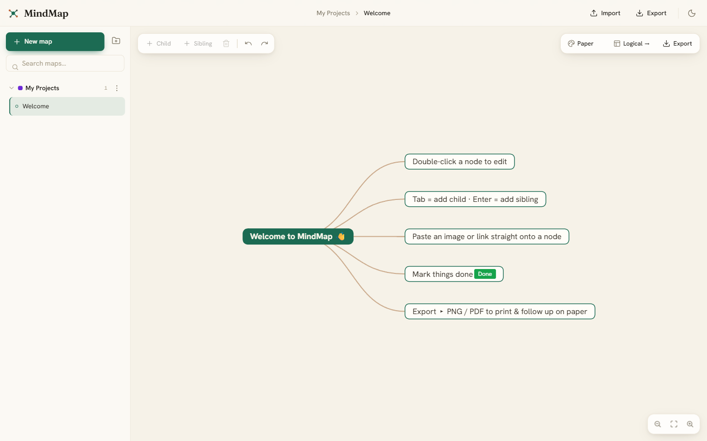

# MindMap

A simple app to map out your ideas and projects, then pick them back up later without losing your place.

Create a map in one click, group your maps into projects, edit ideas right on the screen, drop in pictures and links, tick things off as done, and save or print your map as a picture or PDF.

Best of all, it runs without installing anything. That means it also works on locked down work laptops where you are not allowed to install software.



## What you can do

- Click **New map** and start typing. Press **Tab** for a sub idea, **Enter** for the next idea.
- Group maps into **projects** on the left. Rename, pin, archive, duplicate, and search them.
- Paste a **picture, a link, an email, or a file path** straight onto any idea.
- Mark anything as **done** with a green tag.
- Keep **notes for each project** in the panel on the right.
- **Export or print** your map as a PNG image or a PDF, great for following up on paper.
- Switch between **light and dark**, plus a few map styles.

## Run it on your own PC or laptop

You have two easy options.

**Option 1: the no install version (recommended)**

1. Go to the **Releases** page of this project and download the file named `MindMap-web.zip`.
2. Unzip it anywhere (your Desktop is fine).
3. Double click **start.bat**.
4. Your browser opens with MindMap ready to use.

To stop it, just close the small black window that opened.

**Option 2: the desktop app**

Build the desktop version (see "For developers" below), then double click **MindMap.exe** inside the folder it creates. No installation needed.

## Run it on a work or IT restricted PC

This is the whole reason MindMap exists.

- You do **not** need to install anything and you do **not** need admin rights.
- Use the no install version above. It runs using tools that already come with Windows, so it usually does not trip the security blocks that stop normal programs.
- Copy the unzipped folder onto the work PC (for example through your approved way of moving files) and double click **start.bat**.
- If `start.bat` itself is blocked, you do not need it. Open **Windows PowerShell** and run this one line, pointing at the folder you unzipped:

  ```
  powershell -ExecutionPolicy Bypass -File "C:\path\to\serve.ps1"
  ```

- If your company blocks even that, the desktop app folder also runs by just double clicking **MindMap.exe**. The first time, Windows may show a blue "Windows protected your PC" notice for an unknown publisher. Click **More info** then **Run anyway**.

Nothing is installed and nothing is sent over the internet, so it is friendly to strict environments.

## Your maps stay with you

- Everything is saved **on your own machine**, inside your browser. There is no account, no sign in, and no internet required.
- Use **Export** in the top bar to save a backup file. Keep it somewhere safe or copy it to another computer. Use **Import** to load it back.

## For developers (optional)

Built as a single web app (Vue 3 + Vite) with the open source [simple-mind-map](https://github.com/wanglin2/mind-map) engine. You need [Node.js](https://nodejs.org) installed.

```bash
npm install            # install dependencies
npm run dev            # run locally for development
npm run build          # build the web version into dist/
npm run build:electron # build the desktop app into release/win-unpacked/
```

The "no install" launcher lives in `launcher/` (a tiny PowerShell static server, so the app works offline with nothing but built in Windows). The mind map engine is hidden behind a small interface in `src/engine/`, so it can be swapped or extended without touching the rest of the app.

## License

Free to use, change, and share under the [MIT license](LICENSE). Made as a gift to the community.
